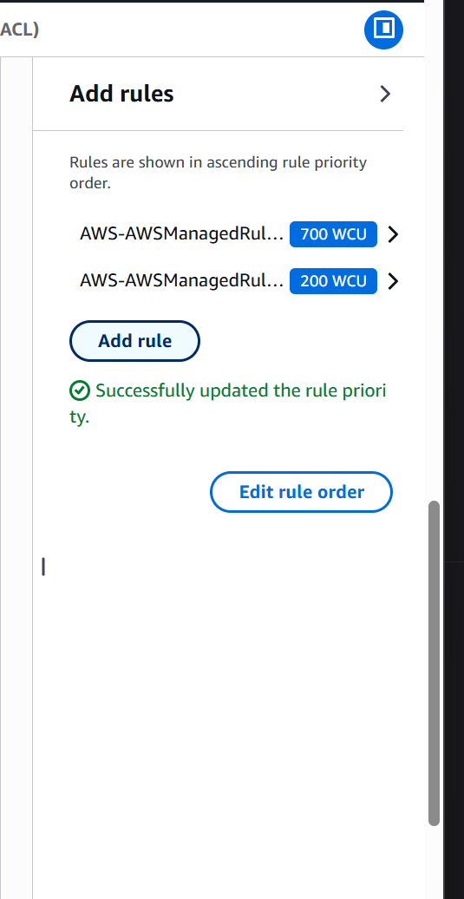
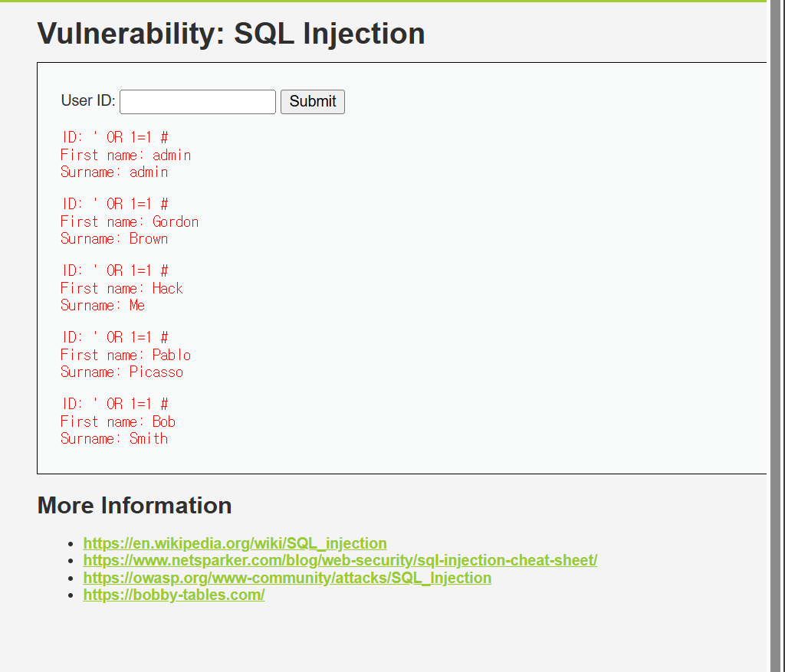
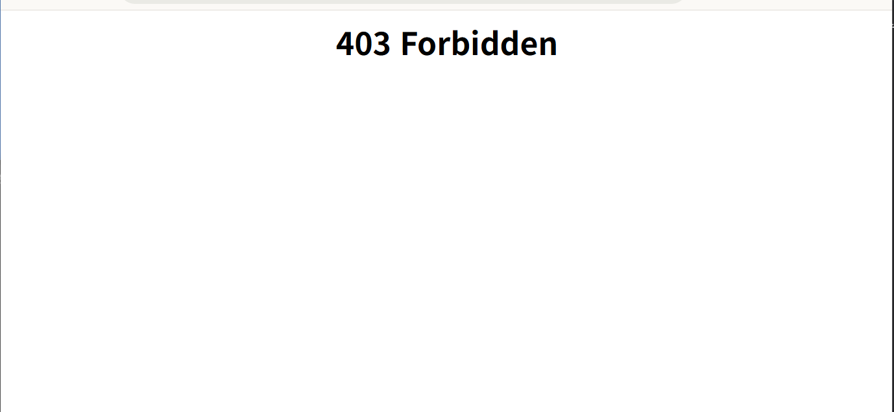

## Overview

AWS WAFv2를 활용해 웹 애플리케이션 공격(SQL Injection, XSS)을 탐지하고 차단하는 환경을 구성한다.

---

## Architecture

```
사용자 → WAF(whs-acl) → ALB(whs-alb) → DVWA 서버(EC2 t3.micro)
```

- **DVWA** (Damn Vulnerable Web Application): 일부러 취약하게 만든 웹앱 (공격 실습용)
- **ALB** (Application Load Balancer): 트래픽 분산 및 WAF 연결 포인트
- **WAF**: 악성 트래픽 차단

---

## Setup

### 1. EC2 Key Pair
- EC2 → 키 페어 → 키 페어 생성
- 이름: `whs` / 유형: RSA / 형식: `.pem`

### 2. CloudFormation (IaC)
- CloudFormation → 스택 생성 → S3 URL 입력
- 스택 이름: `whs` / KeyName: `whs`
- IAM 리소스 생성 승인 체크 후 전송 → 약 5분 대기

> 💡 CloudFormation = 인프라를 코드로 정의해 자동 생성하는 IaC 도구  
> 현업에서는 **Terraform**을 많이 사용

### 3. WAF & Shield
- WAF & Shield → Protection packs (web ACLs) → Create
- 이름: `whs-acl`
- 리전: 아시아 태평양(서울)
- **whs-alb 연결** ← 이거 꼭 해야 WAF가 실제로 동작함!

### 4. WAF Rules



| 규칙 | WCU | 역할 |
|------|-----|------|
| AWS-AWSManagedRulesCommonRuleSet | 700 | OWASP Top 10 (XSS, SQLi 등) |
| AWS-AWSManagedRulesSQLiRuleSet | 200 | SQL Injection 전용 |

---

## Test

### Before WAF — 공격 성공



#### SQL Injection
```
입력값: ' OR 1=1 #
결과: DB 전체 유저 정보 노출 (admin, Gordon, Hack, Pablo, Bob)
```

**원리:**
```sql
-- 원래 의도한 쿼리
SELECT * FROM users WHERE id = '입력값'

-- 공격 후
SELECT * FROM users WHERE id = '' OR 1=1 #'
-- OR 1=1 → 항상 참 → 전체 데이터 반환
-- # → 뒤 구문 주석 처리
```

#### XSS (Reflected)
```
입력값: <script>alert(document.cookie)</script>
결과: 세션 쿠키 정보 팝업 노출
```

**원리:** 입력값이 HTML로 해석되어 스크립트 실행 → 쿠키 탈취 가능

---

### After WAF — 공격 차단 



```
' OR 1=1 #  →  403 Forbidden
<script>alert(document.cookie)</script>  →  403 Forbidden
```

---

## 기억해라

- WAF는 ALB에 **반드시 연결** 해야 실제 동작함
- ALB DNS 주소로 접속해야 WAF를 거침 (EC2 IP 직접 접속 시 WAF 우회됨)
- AWS Managed Rules 사용
